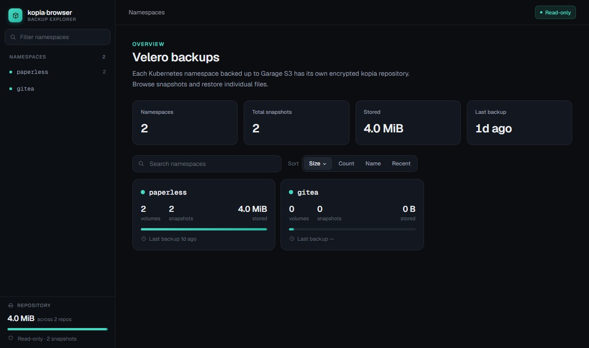
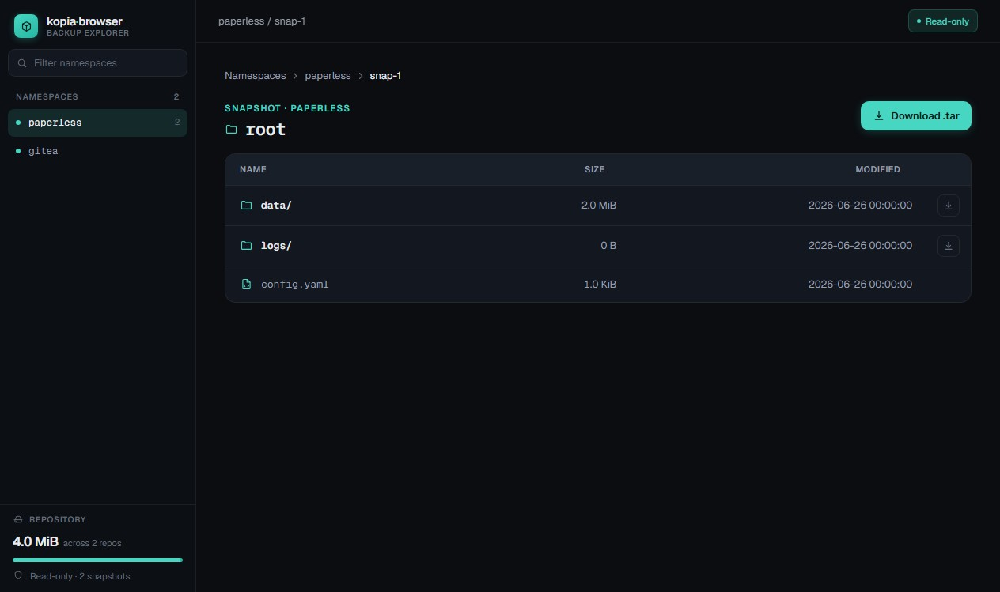
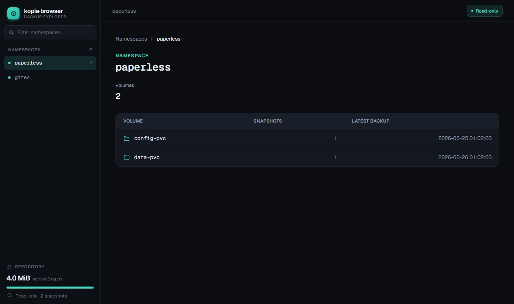
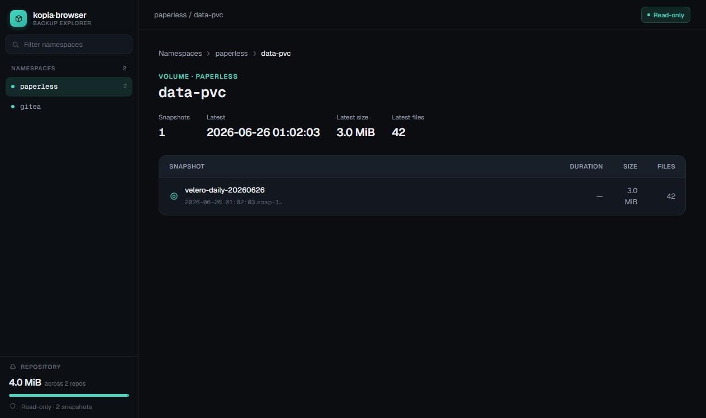

# kopia-browser

Web app to browse [Velero](https://velero.io/)-created [kopia](https://kopia.io/) backups stored on S3.
Browse namespaces, view snapshots, navigate directory trees, and download files or whole folders.
**Read-only** — never modifies anything in your kopia repos or S3 bucket.

[](https://github.com/nicojeske/kopia-browser/actions/workflows/ci.yml)
[](https://github.com/nicojeske/kopia-browser/pkgs/container/kopia-browser)

## Screenshots

| Dashboard | Browse |
|-----------|--------|
|  |  |

| Volumes | Snapshots |
|---------|-----------|
|  |  |

## Features

- **Namespace list** — one card per Velero namespace, with snapshot count, total size, and last-backup time
- **Volume grouping** — snapshots grouped by Velero `volume` tag, with per-volume navigation
- **Snapshot table** — backup name, timestamp, size, file count
- **Directory tree** — htmx-powered partial navigation (no full-page reloads)
- **File download** — single file streamed directly from kopia
- **Folder download** — entire directory streamed as a `.tar` archive (no temp disk)
- **Dashboard stats** — background-refreshing stat cards (namespace count, total snapshots, total stored, last backup)
- **Dark UI** — self-hosted Geist fonts, CSS custom properties, responsive sidebar
- **No in-app auth** — deploy behind an SSO reverse proxy; the app trusts the proxy

## Architecture

```
browser ──HTTP/htmx──> kopia-browser (Go) ──kopia lib──> Garage S3 (velero-backup/kopia/<ns>/)
```

Single Go binary: Go backend + [html/template](https://pkg.go.dev/html/template) + [htmx](https://htmx.org/).
One kopia repository opened per namespace, cached and reused across requests, strictly read-only.

See [docs/ARCHITECTURE.md](docs/ARCHITECTURE.md) for component details and data-flow diagrams.

## Configuration

Copy `.env.example` to `.env` for local development (`.env` is gitignored).
In production, pass these as environment variables — never commit real secret values.

| Variable | Required | Default | Purpose |
|----------|----------|---------|---------|
| `S3_ENDPOINT` | ✅ | — | Garage S3 host:port, e.g. `tailscale-garage-s3:3900` |
| `S3_ACCESS_KEY` | ✅ | — | S3 access key |
| `S3_SECRET_KEY` | ✅ | — | S3 secret key |
| `KOPIA_REPO_PASSWORD` | ✅ | — | Shared kopia repo password (set by Velero) |
| `S3_REGION` | | `garage` | S3 region string |
| `S3_BUCKET` | | `velero-backup` | S3 bucket name |
| `KOPIA_PREFIX` | | `kopia/` | Prefix under which repos live (`kopia/<namespace>/`) |
| `KOPIA_CACHE_DIR` | | `.kopia-cache` | Writable directory for kopia config + cache (must be absolute in k8s) |
| `LISTEN_ADDR` | | `:8080` | HTTP listen address |
| `STATS_REFRESH_INTERVAL` | | `60m` | How often background stats refresh (Go duration) |
| `LOG_LEVEL` | | `info` | Log verbosity: `debug` \| `info` \| `warn` \| `error` |

## Run locally

```bash
cp .env.example .env
# Fill in S3_ENDPOINT, S3_ACCESS_KEY, S3_SECRET_KEY, KOPIA_REPO_PASSWORD in .env
make run
# or: go run ./cmd/kopia-browser
```

Server starts at `http://localhost:8080`.

## Docker

```bash
# Build image
make docker

# Run with env file
docker run --env-file .env -p 8080:8080 ghcr.io/nicojeske/kopia-browser

# Or pull from GHCR
docker pull ghcr.io/nicojeske/kopia-browser:latest
docker run --env-file .env -p 8080:8080 ghcr.io/nicojeske/kopia-browser:latest
```

## Build and test

```bash
make build              # binary → bin/kopia-browser
make test               # unit + handler tests (offline, no S3)
make test-integration   # integration tests vs real Garage (needs creds in .env)
make e2e                # browser E2E tests via headless Chrome (needs Chrome/Chromium)
make screenshots        # capture UI screenshots into docs/screenshots/ (needs Chrome/Chromium)
```

## Deployment (k8s)

Deploy behind an SSO reverse proxy — the app has no in-app authentication.

Key requirements:
- Writable volume mounted at `KOPIA_CACHE_DIR` (kopia needs to write config + cache per namespace)
- `KOPIA_CACHE_DIR` must be an absolute path in the container
- All credentials injected as env vars or a mounted secret

Image: `ghcr.io/nicojeske/kopia-browser` — built and published by CI on every push to `main` and on `v*` tags.

> **Read-only safety:** kopia-browser never writes to or deletes from your kopia repos or S3 bucket.
> It opens each repository in read-only mode and only exposes list/browse/download operations.

## Docs

- [docs/ARCHITECTURE.md](docs/ARCHITECTURE.md) — components, routes, data flow, testing layers
- [docs/PLAN.md](docs/PLAN.md) — milestone history and feature checklist
- [docs/KOPIA.md](docs/KOPIA.md) — verified kopia/Velero/Garage facts and commands
- [docs/DECISIONS.md](docs/DECISIONS.md) — architecture decision log
- [docs/JOURNAL.md](docs/JOURNAL.md) — per-session development notes

## License

[MIT](LICENSE)
